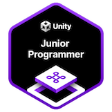

## Hi there 👋  I'm Akkapon (App)

## 🏅 Certifications

## 🚀 About Me  
I'm a technical lead, passionate about the cutting edge solution for XR and AI with Unity and NodeJS technology. I specialize in building mobile super app and game that deliver impactful user experiences.  

I bring a unique blend of those technologies, turning ideas into reality through code. My goal is to create **immersive applications** and tools that **enhance productivity** and **spark imagination**.  

## 🔧 Skills & Technologies  

- **Programming Languages:** Typescript, C#, Java, Dart
- **Frameworks & Libraries:** Flutter, Spring Boot, ExpressJS, React Native, ReactJS
- **Game Development Tools:** Unity Engine 
  

